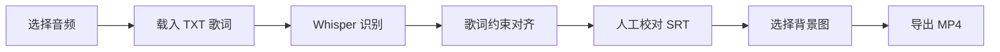

# Lyrics Video Maker Studio


一款面向中文歌曲的本地桌面工具：用标准歌词约束 Whisper 识别结果，生成更容易校对的 SRT 时间轴，并渲染为滚动歌词视频。

> 当前状态：Windows 桌面测试版。音频与项目数据默认只在本机处理。

## 为什么做它

普通语音识别会把歌词听错；单纯按识别文本生成字幕，又会让错字和时间误差一起进入成品。本项目把“标准歌词文本”和“模型识别时间”拆开处理：文字以用户提供的 TXT 为准，模型主要负责寻找演唱位置。

## 功能

- `large-v3-turbo` 与 `small` 两档 Whisper 模型
- CPU `int8` 与 NVIDIA GPU `float16` 可选
- 字级时间戳与歌词约束对齐
- SRT 导入、保存、逐行编辑和批量时间微调
- 项目文件保存与恢复
- 滚动歌词预览和 MP4 渲染
- 完整保留前奏、间奏与尾奏
- 导出前磁盘空间预检，失败时清理残缺文件
- 全流程本地运行，无账号、广告和遥测

## 工作流



## 快速开始

要求：Windows 10/11、Python 3.11 或 3.12、FFmpeg。

```powershell
git clone https://github.com/YaterlanWEB/lyrics-video-maker-studio.git
cd lyrics-video-maker-studio
python -m venv .venv
.\.venv\Scripts\Activate.ps1
python -m pip install --upgrade pip
pip install -r requirements.txt
python app_qt.py
```

也可以在安装完成后双击 `start.bat`。

如果 FFmpeg 已加入 `PATH`，程序会自动发现；也可以在界面中选择 `ffmpeg.exe`。第一次使用某个 Whisper 模型时需要联网下载，之后可以离线识别。

## 使用步骤

1. 选择音频和 UTF-8 编码的 TXT 歌词。
2. 选择“高精度”或“快速兼容”，再选择 CPU 或 NVIDIA GPU。
3. 生成 SRT 初稿，在表格中校对文字和时间。
4. 选择背景图、标题、署名及 MP4 输出位置。
5. 预览画面，确认后导出视频。

`examples/` 提供了不含真实歌曲或个人信息的歌词与 SRT 示例。

## 项目结构

```text
app_qt.py             Qt 桌面界面
core.py               项目模型与 SRT 读写
srt_generator.py      音频识别与歌词约束对齐
render_engine.py      画面生成与 FFmpeg 导出
tests/                单元测试
examples/             脱敏示例
docs/                 架构和绿色版打包说明
```

更多原理见 [架构说明](docs/ARCHITECTURE.md)，便携版目录见 [Windows 绿色版打包](docs/PORTABLE_BUILD.md)，隐私注意事项见 [SECURITY.md](SECURITY.md)。

欢迎通过 Issue 提交可脱敏复现的问题，开发约定见 [CONTRIBUTING.md](CONTRIBUTING.md)。

## 测试

```powershell
python -m unittest discover -s tests -p "test_*.py" -v
```

## 已知限制

- 歌声混响、多人合唱、方言和高强度伴奏仍可能造成时间偏差。
- GPU 模式依赖兼容的 NVIDIA 驱动、CUDA 运行库和足够显存。
- 仓库不分发第三方模型和编解码器二进制。
- 自动结果仍建议人工抽查，尤其是快唱和重叠人声片段。

## 数据与版权

请只处理你有权使用的音频、歌词和图片。仓库不会上传用户素材，但项目文件可能记录本机路径，公开分享前请检查并脱敏。

## 许可

本仓库暂未附加开源许可证。源码可供阅读和学习；复制、修改、再分发或商业使用的授权范围将在许可证确定后补充。

