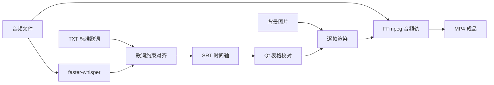

# 架构说明

## 模块

- `app_qt.py`：PySide6 桌面界面、任务线程、项目编辑和自检。
- `core.py`：项目数据结构、SRT 解析与序列化、默认路径发现。
- `srt_generator.py`：Whisper 推理、字级时间戳、歌词约束和缺失片段补偿。
- `render_engine.py`：画面布局、滚动动画、FFmpeg 编码、磁盘空间及音频完整性检查。

## 对齐策略

高精度模式读取 Whisper 字级时间戳，将识别字符与用户提供的标准歌词进行全局序列匹配。标准歌词负责文字正确性，识别结果只提供时间锚点。未识别到的行会在相邻可靠锚点之间按长度和前一句结束时间补齐。

快速模式使用片段级时间锚点，速度更快，但在连唱、和声和长间奏场景中精度较低。

## 渲染策略

画面由 Pillow 逐帧生成并通过标准输入发送给 FFmpeg。原音频作为独立输入映射到 MP4，编码命令不使用 `-shortest`，避免歌词结束后截断尾奏。导出后会比较源音频与成品音轨时长。
